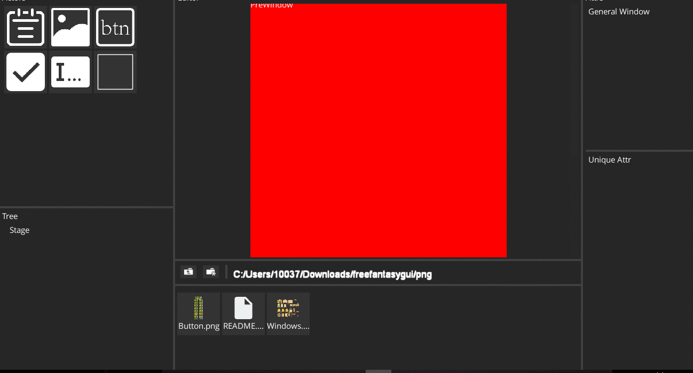

# libgdx_ui_editor

  
A game ui editor for libgdx

### Documentation
 Usage is very simple  
 
  *First, click "File" in the upper left corner and click "Open Project"  
  *Then, in the bottom of the resource window, right-click New Scene, create a **.vwx file,double-click it.  
  *Final, A Simple Example is [here](/editor_runtime/src/xyz/white/runtime/TestGame.java)

### Shortcuts  
*Space + wheel -- Zoom the edit window  
*Space + Left  -- Move the edit window  
*Mouse Right   -- Multiple choice actors

### Next
   *More shortcuts  
   *More Actor are supported

### Thanks
*[Libgdx](https://github.com/libgdx/libgdx) --a cross-platform Java game development framework  

*[VisUI](https://github.com/kotcrab/vis-editor/wiki/VisUI) -- a UI Library  

